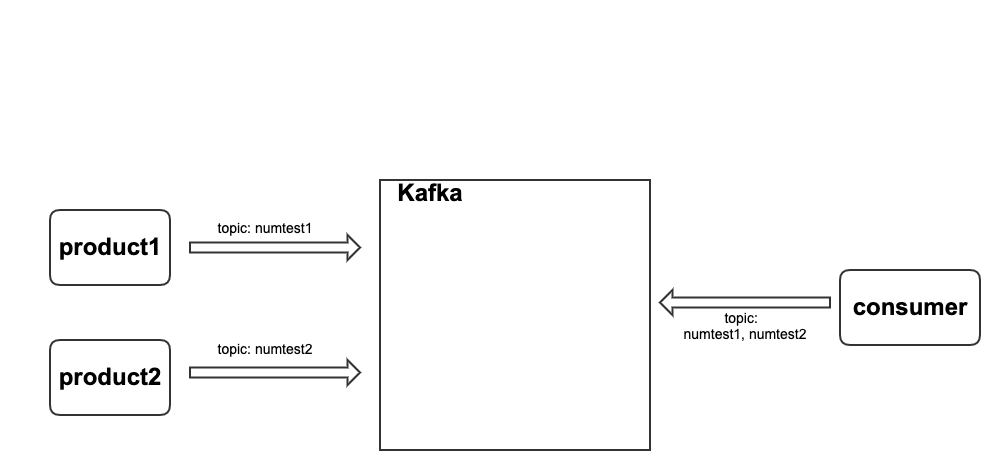

* **`Architecture`**



* **`kafka run`**

```bash
$ docker-compose -f docker-compose.yaml up
```

* **`productor run`**

```bash
# topic: numtest1
$ python product1.py
```

```bash
# topic: numtest2
$ python product2.py
```

* **`consumer run`**

```bash
$ python consumer.py
```